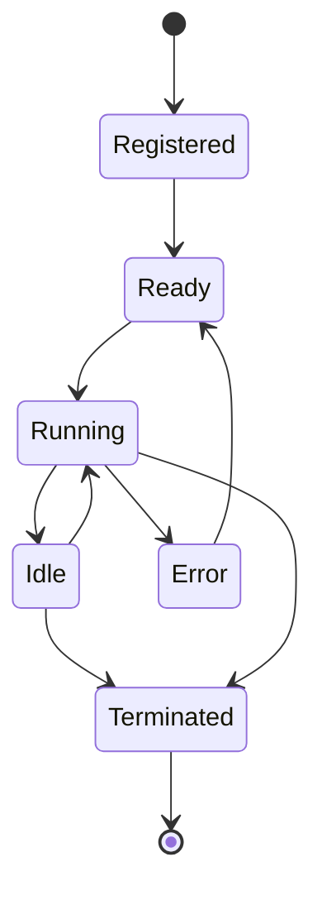

<Warning>
  **Coming Soon** - Agent orchestration features are planned for Conductor v1.0.
</Warning>

## What are Conductor Agents?

In Conductor, agents are autonomous units of work that can:

- Execute tasks independently
- Communicate with other agents
- Maintain internal state
- Respond to events
- Make decisions based on context

## Planned Features

### Agent Lifecycle


### Agent Types

<Tabs>
  <Tab title="Task Agents">
    Execute specific, well-defined tasks

    **Example**: Email processor, data validator, report generator
  </Tab>

  <Tab title="Decision Agents">
    Make decisions based on input and rules

    **Example**: Approval bot, routing agent, triage system
  </Tab>

  <Tab title="Coordinator Agents">
    Orchestrate other agents to accomplish goals

    **Example**: Project manager agent, workflow coordinator
  </Tab>

  <Tab title="Monitor Agents">
    Observe systems and trigger actions

    **Example**: Health check agent, alert generator
  </Tab>
</Tabs>

## Agent Communication

Agents will communicate through:

- **Direct Messages**: One-to-one communication
- **Broadcasts**: One-to-many announcements
- **Pub/Sub**: Topic-based messaging
- **Request/Reply**: Synchronous interactions

## Integration with Edgit

Agents registered in Edgit are automatically available in Conductor:

```bash
# Register agent in Edgit
edgit add agent email-processor src/agents/email.ts

# Deploy agent version
edgit tag email-processor v1.0.0

# Conductor auto-discovers and can orchestrate it
```

## Coming Soon

- Agent SDK documentation
- Communication protocols
- State management patterns
- Error handling strategies
- Performance tuning guides

<Info>
  Interested in agent development? Follow updates at [conductor/agents](https://github.com/ensemble-edge/conductor).
</Info>
