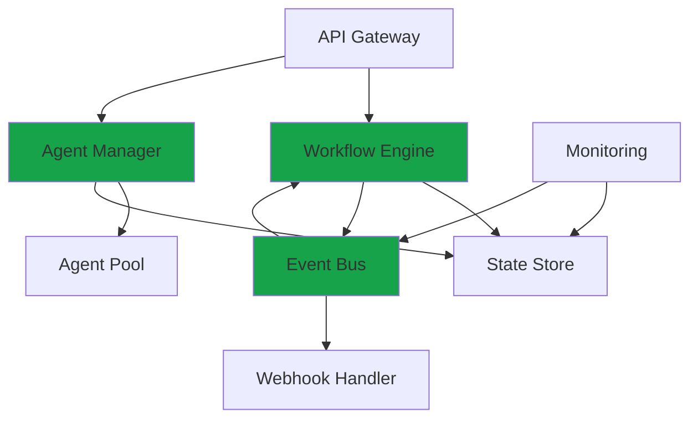

<Warning>
  **Coming Soon** - This documentation describes planned architecture for Conductor, currently in development.
</Warning>

## System Overview

Conductor is designed as a distributed orchestration platform with the following core components:

## Core Components

### Workflow Engine
- Executes workflow definitions
- Manages execution state
- Handles error recovery
- Coordinates agent invocations

### Agent Manager
- Discovers agents from Edgit registry
- Manages agent lifecycle
- Handles load balancing
- Monitors agent health

### Event Bus
- Pub/sub messaging system
- Workflow triggers
- Inter-agent communication
- System-wide event distribution

### State Store
- Persistent workflow state
- Agent execution history
- Configuration storage
- Audit logs

## Design Principles

<AccordionGroup>
  <Accordion icon="shield" title="Reliability">
    - At-least-once execution guarantees
    - Automatic retry with exponential backoff
    - Dead letter queues for failed workflows
    - State checkpointing
  </Accordion>

  <Accordion icon="gauge" title="Scalability">
    - Horizontal scaling of workflow engines
    - Agent pool autoscaling
    - Distributed state management
    - Event-driven architecture
  </Accordion>

  <Accordion icon="eye" title="Observability">
    - Detailed execution logs
    - Performance metrics
    - Distributed tracing
    - Real-time monitoring
  </Accordion>

  <Accordion icon="lock" title="Security">
    - End-to-end encryption
    - Role-based access control
    - Audit logging
    - Secret management
  </Accordion>
</AccordionGroup>

## Technology Stack

| Component | Technology | Reason |
|-----------|-----------|--------|
| Workflow Engine | TypeScript | Type safety, Edgit integration |
| State Store | PostgreSQL + Redis | Reliability + performance |
| Event Bus | NATS | High throughput, clustering |
| Agent Runtime | Isolated containers | Security, isolation |
| API Gateway | Node.js + Express | Consistency with ecosystem |

## Coming Soon

Detailed architecture documentation will include:

- Component interaction diagrams
- Data flow patterns
- Deployment topologies
- Performance characteristics
- Security model
- Integration patterns

<Info>
  Want to contribute to the architecture discussion? Join us on [GitHub Discussions](https://github.com/ensemble-edge/conductor/discussions).
</Info>
