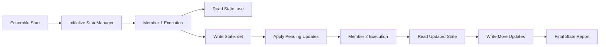

## System Overview

Conductor is built on Cloudflare Workers with a clean, composable architecture designed for edge execution. The system follows functional programming principles with immutable state management and explicit error handling.

```mermaid
graph TB
    A[HTTP Request] --> B[Hono API Layer]
    B --> C[Executor]

    C --> D[Parser]
    C --> E[StateManager]
    C --> F[Member Registry]

    D --> G[YAML/Config]
    E --> H[Immutable State]
    F --> I[Think Members]
    F --> J[Function Members]
    F --> K[Data Members]
    F --> L[API Members]
    F --> M[Built-In Members]

    I --> N[AI Provider Registry]
    K --> O[Storage Repositories]

    N --> P[OpenAI/Anthropic/Workers AI]
    O --> Q[KV/D1/R2/Vectorize]

    C --> R[Durable Objects]
    R --> S[ExecutionState]
    R --> T[HITLState]

    style C fill:#2D1B69
    style E fill:#2D1B69
    style F fill:#2D1B69
    style N fill:#4FD1C5
    style O fill:#4FD1C5
```



## Core Components

### Executor (`src/runtime/executor.ts`)

The orchestration engine that executes ensembles and coordinates member execution.

**Responsibilities:**
- Parse YAML ensemble definitions
- Manage execution flow with Result types
- Coordinate state updates between members
- Handle caching, scoring, and retry logic
- Support suspension and resumption (HITL workflows)

**Key Features:**
- Result-based error handling (no exceptions)
- Supports sequential, parallel, and conditional flows
- Built-in scoring and quality evaluation
- WebAssembly-ready (no Node.js dependencies)

### Parser (`src/runtime/parser.ts`)

YAML parser and validation using Zod schemas with template interpolation.

**Responsibilities:**
- Parse ensemble and member YAML
- Validate configurations against schemas
- Resolve interpolations (`${input.x}`, `${state.y}`)
- Parse member references with versions

**Interpolation Syntax:**
```yaml
input:
  domain: ${input.domain}           # From input
  cached: ${state.analysis}         # From shared state
  previous: ${fetch-data.output.result}  # From member output
  api_key: ${env.OPENAI_API_KEY}    # From environment
```

### StateManager (`src/runtime/state-manager.ts`)

Immutable state management with access tracking and selective member visibility.

**Responsibilities:**
- Provide immutable state context
- Track which members access which keys
- Apply pending updates after member execution
- Generate access reports for optimization

**Design:**
```typescript
// Returns NEW instance on every mutation
const newManager = manager.applyPendingUpdates(updates, log);

// Members only see declared keys
getStateForMember(memberName, {
  use: ['companyData'],  // Can read
  set: ['analysis']      // Can write
});
```

### GraphExecutor (`src/runtime/graph-executor.ts`)

Advanced workflow engine for complex flow patterns.

**Supported Patterns:**
- **Parallel** - Execute steps concurrently
- **Branch** - Conditional execution (if/then/else)
- **ForEach** - Loop over arrays with concurrency control
- **Try/Catch** - Error handling
- **Switch** - Multi-way branching
- **While** - Conditional loops with safety limits
- **Map-Reduce** - Map/reduce pattern with aggregation

## Member Architecture

### Base Member (`src/members/base-member.ts`)

Abstract base class providing common functionality for all member types.

**Lifecycle:**
1. `execute()` - Entry point with caching check
2. `run()` - Abstract method implemented by subclasses
3. `wrapSuccess/wrapError()` - Response formatting
4. `generateCacheKey()` - Cache key generation

**Response Format:**
```typescript
interface MemberResponse {
  success: boolean
  data?: unknown
  error?: string
  timestamp: string
  cached: boolean
  executionTime: number
  metadata?: Record<string, unknown>
}
```

### Member Types

<CardGroup cols={2}>
  <Card title="Think Member" icon="brain">
    AI reasoning via provider system (OpenAI, Anthropic, Workers AI, Groq)
  </Card>

  <Card title="Function Member" icon="code">
    JavaScript/TypeScript business logic execution
  </Card>

  <Card title="Data Member" icon="database">
    Storage operations (KV, D1, R2, Vectorize) via repository pattern
  </Card>

  <Card title="API Member" icon="globe">
    HTTP requests to external services with retry logic
  </Card>
</CardGroup>

### Built-In Members

Lazy-loaded members that provide production-ready functionality:

```typescript
// Registry pattern with lazy loading
const member = getBuiltInRegistry().create('scrape', config, env);

// Only loaded when first used
// Reduces initial bundle size
```

**Available:**
- `scrape` - Web scraping with fallback strategies
- `validate` - Quality evaluation with pluggable evaluators
- `rag` - RAG system with Vectorize
- `hitl` - Human-in-the-Loop workflows
- `fetch` - HTTP client with retry
- `queries` - SQL execution with Hyperdrive

## Three-Layer Platform Architecture

Clean separation enabling multi-cloud support:

### Layer 1: AI Providers (`catalog/ai/`)

JSON catalogs containing:
- Model lists and capabilities
- API endpoints and authentication
- Deprecation tracking
- Cost and context window information

```json
{
  "provider": "openai",
  "models": [
    {
      "id": "gpt-4o",
      "status": "active",
      "contextWindow": 128000
    }
  ]
}
```

### Layer 2: Cloud Platforms (`catalog/cloud/`)

Infrastructure configurations:
- Cloudflare Workers, KV, D1, R2, Vectorize
- AI Gateway configuration
- Platform capabilities and bindings

### Layer 3: Base Interfaces (`src/platforms/base/`)

Platform-agnostic abstractions:
- `AIProvider` interface
- `Repository<T, K>` interface
- `Platform` abstract class

## Design Patterns

### 1. Result Types for Error Handling

No exceptions in core runtime - explicit error handling:

```typescript
type Result<T, E> =
  | { success: true; value: T }
  | { success: false; error: E }

const result = await executor.executeEnsemble(config, input);
if (result.success) {
  console.log(result.value.output);
} else {
  console.error(result.error);
}
```

### 2. Composition Over Inheritance

**Provider Registry:**
```typescript
const registry = getProviderRegistry();
registry.register('openai', new OpenAIProvider());
const provider = registry.get('openai');
```

**Repository Pattern:**
```typescript
interface Repository<T, K> {
  get(key: K): AsyncResult<T, RepositoryError>
  put(key: K, value: T): AsyncResult<void, RepositoryError>
}

const kv = new KVRepository(env.CACHE);
const result = await kv.get('key');
```

**Resolver Chain:**
```typescript
const interpolator = new Interpolator(
  new StringResolver(
    new ArrayResolver(
      new ObjectResolver(
        new PassthroughResolver()
      )
    )
  )
);
```

### 3. Immutability

StateManager returns new instances on every mutation:

```typescript
// Functional approach - no mutations
const manager1 = new StateManager(config);
const manager2 = manager1.applyPendingUpdates(updates);
const manager3 = manager2.clearAccessLog();

// manager1, manager2, manager3 are all different instances
```

### 4. Lazy Loading

Built-in members load on demand:

```typescript
class BuiltInMemberRegistry {
  private factories = new Map<string, () => BaseMember>();

  create(name: string): BaseMember {
    const factory = this.factories.get(name);
    return factory(); // Load only when needed
  }
}
```

## State Management Architecture

### Shared State Flow



### Access Tracking

StateManager tracks all state access:

```typescript
interface AccessReport {
  unusedKeys: string[]  // Keys declared but not accessed
  accessPatterns: Record<string, AccessLogEntry[]>
}

// Use report to optimize state usage
const report = manager.getAccessReport();
if (report.unusedKeys.length > 0) {
  console.warn('Unused state keys:', report.unusedKeys);
}
```

## AI Provider System

### Routing Modes

<Tabs>
  <Tab title="cloudflare">
    **Platform-Native (Workers AI only)**

    ```yaml
    config:
      provider: workers-ai
      model: "@cf/meta/llama-3.1-8b-instruct"
      routing: cloudflare
    ```

    - Ultra-low latency
    - No API keys needed
    - Edge execution
  </Tab>

  <Tab title="cloudflare-gateway">
    **AI Gateway (Recommended)**

    ```yaml
    config:
      provider: openai
      model: gpt-4o
      routing: cloudflare-gateway
    ```

    - Persistent caching
    - Real-time analytics
    - Rate limiting
    - Cost controls
  </Tab>

  <Tab title="direct">
    **Direct API Calls**

    ```yaml
    config:
      provider: anthropic
      model: claude-3-5-sonnet-20241022
      routing: direct
    ```

    - Bypass gateway
    - Provider-specific features
  </Tab>
</Tabs>

### Provider Registry

```typescript
interface AIProvider {
  getConfigError(config: AIProviderConfig, env: Env): string | null
  execute(request: AIProviderRequest): Promise<AIProviderResponse>
}

// Singleton registry
const registry = getProviderRegistry();
registry.register('custom-provider', new CustomProvider());
```

## Durable Objects

### ExecutionState

Strongly consistent async execution tracking:

```typescript
// Create Durable Object stub
const id = env.EXECUTION_STATE.idFromName(executionId);
const stub = env.EXECUTION_STATE.get(id);

// Track execution progress
await stub.fetch('/start', { method: 'POST', body: JSON.stringify(data) });
await stub.fetch('/progress', { method: 'POST', body: JSON.stringify(progress) });
await stub.fetch('/complete', { method: 'POST', body: JSON.stringify(result) });

// Query status
const response = await stub.fetch('/status');
const status = await response.json();
```

**Features:**
- Single-threaded execution (no race conditions)
- Transactional storage
- WebSocket streaming for live updates
- Global uniqueness per execution ID

### HITLState

Human-in-the-Loop state management:

```typescript
// Suspend execution for approval
const token = generateToken();
await hitlStub.fetch('/suspend', {
  method: 'POST',
  body: JSON.stringify({ token, suspendedState, ttl: 3600 })
});

// Human approves
await hitlStub.fetch('/approve', {
  method: 'POST',
  body: JSON.stringify({ token, approvalData })
});

// Resume execution
const result = await executor.resumeExecution(suspendedState, approvalData);
```

**Features:**
- Alarm-based TTL expiration
- WebSocket notifications
- Approval/rejection tracking
- Resume token management

## API Layer

Built with [Hono](https://hono.dev/) - lightweight web framework for edge runtimes.

### Middleware Pipeline

```typescript
app.use('*', requestId());        // Add request ID
app.use('*', timing());           // Track request timing
app.use('/api/*', auth());        // API key authentication
app.use('*', errorHandler());     // Global error handling
```

### Route Structure

```
/api/v1/execute          - Execute ensemble
/api/v1/executions/:id   - Get execution status
/api/v1/members          - List members
/api/v1/schedules        - Manage schedules
/webhooks/:path          - Webhook handlers
/health                  - Health check
```

## Caching Strategy

Multi-layer caching for performance and cost optimization:

### Member-Level Caching

```yaml
flow:
  - member: expensive-ai-call
    cache:
      ttl: 3600      # 1 hour
      bypass: false
```

### KV Cache Manager

```typescript
class CacheManager {
  async get<T>(key: string): Promise<T | null>
  async set<T>(key: string, value: T, ttl?: number): Promise<void>
  async delete(key: string): Promise<void>
}
```

### AI Gateway Caching

Persistent caching at the edge for AI provider calls:
- Cache hit rate tracking
- TTL control
- Cache invalidation
- Analytics integration

## Observability

### Structured Logging

```typescript
interface Logger {
  debug(message: string, data?: unknown): void
  info(message: string, data?: unknown): void
  warn(message: string, data?: unknown): void
  error(message: string, error?: Error, data?: unknown): void
}

const logger = createLogger({ serviceName: 'conductor' }, analytics);
```

### OpenTelemetry Support

```typescript
// Structured logs for Analytics Engine
analytics.writeDataPoint({
  blobs: [executionId, ensembleName],
  doubles: [duration, cost],
  indexes: [timestamp]
});
```

### Execution Metrics

```typescript
interface ExecutionMetrics {
  ensemble: string
  totalDuration: number
  members: MemberMetric[]
  cacheHits: number
  stateAccess?: AccessReport
}
```

## Performance Characteristics

### Cold Start Performance

| Metric | Value |
|--------|-------|
| Cold start (simple) | < 50ms |
| Cold start (with AI) | < 100ms |
| Warm execution | < 10ms |
| State access | < 1ms |

### Scalability

- **Concurrent executions**: Unlimited (Cloudflare Workers)
- **State size**: Up to 128 KB per ensemble
- **Member outputs**: Up to 25 MB (KV limit)
- **Execution duration**: Up to 30 seconds (HTTP), unlimited (async)

### Cost Optimization

- **Lazy loading**: Only load members used
- **KV caching**: Reduce AI provider costs
- **AI Gateway**: Persistent caching across executions
- **Smart routing**: Use Workers AI for cost-effective edge models

## Security Model

### API Authentication

```typescript
app.use('/api/*', auth({
  apiKeys: [env.API_KEY_1, env.API_KEY_2],
  allowAnonymous: false
}));
```

### Webhook Signature Verification

```yaml
webhooks:
  - path: "/stripe-payment"
    auth:
      type: signature
      secret: ${env.STRIPE_WEBHOOK_SECRET}
```

### Environment Variable Isolation

- API keys stored in Workers secrets
- Environment-specific configurations
- No secrets in YAML definitions

## Design Principles

<AccordionGroup>
  <Accordion icon="cube" title="Edge-First">
    Every component designed for Cloudflare Workers execution. No Node.js dependencies, WebAssembly-ready.
  </Accordion>

  <Accordion icon="git" title="Git-Native">
    Configuration, orchestration, and versioning live in Git. CLI and SDK are thin layers around Git operations.
  </Accordion>

  <Accordion icon="database" title="Cache-Central">
    Multi-layer caching with TTL control. Member-level cache settings. Cache-first thinking reduces costs.
  </Accordion>

  <Accordion icon="code" title="Structured Outputs">
    All members produce machine-readable, type-safe output validated via JSON schema/Zod.
  </Accordion>

  <Accordion icon="chart-line" title="Observable by Default">
    Every execution emits structured logs and metrics. Debugging and transparency are effortless.
  </Accordion>

  <Accordion icon="lock-open" title="Open by Default">
    Core tooling is open source. No vendor lock-in. Use it, fork it, build on it.
  </Accordion>
</AccordionGroup>

## Related Documentation

<CardGroup cols={2}>
  <Card
    title="Core Classes API"
    icon="code"
    href="/conductor-api/core/executor"
  >
    Detailed API documentation for Executor, Parser, StateManager
  </Card>

  <Card
    title="Member Types"
    icon="users"
    href="/conductor/member-types/overview"
  >
    Learn about Think, Function, Data, and API members
  </Card>

  <Card
    title="Built-In Members"
    icon="cube"
    href="/conductor/built-in-members/overview"
  >
    Production-ready members you can use immediately
  </Card>

  <Card
    title="Testing Framework"
    icon="flask"
    href="/conductor/guides/testing"
  >
    Test your ensembles with TestConductor
  </Card>
</CardGroup>
