## Why Caching Matters

AI and API calls are expensive. Caching the same request can save you **90%+ on costs** and reduce latency from seconds to milliseconds. Conductor provides multi-layer caching out of the box.

<CardGroup cols={2}>
  <Card title="Cost Savings" icon="dollar-sign">
    Cache identical AI requests - pay once, use many times
  </Card>

  <Card title="Speed" icon="bolt">
    Cached responses return in < 5ms vs 1-2 seconds for API calls
  </Card>

  <Card title="Reliability" icon="shield">
    Continue working even if AI providers have outages
  </Card>

  <Card title="Rate Limits" icon="gauge">
    Reduce API calls to stay within provider rate limits
  </Card>
</CardGroup>

## How Caching Works

```mermaid
graph LR
    A[Execute Member] --> B{Check KV Cache}
    B -->|Cache Hit| C[Return Cached Result]
    B -->|Cache Miss| D[Execute Member]
    D --> E[Store in KV Cache]
    E --> F[Return Result]

    style B fill:#4FD1C5
    style C fill:#2D1B69
    style E fill:#E91E8C
```



## Three Caching Layers

Conductor provides three complementary caching layers:

### 1. Member-Level Cache (KV)

Conductor's built-in cache using Cloudflare KV:

```yaml
flow:
  - member: expensive-ai-call
    cache:
      ttl: 3600      # Cache for 1 hour
      bypass: false  # Respect cache (default)
```

**Features:**
- Automatic cache key generation (member name + input hash)
- TTL control per member
- Cache bypass option
- Works across all member types

### 2. AI Gateway Cache

Cloudflare AI Gateway provides persistent caching for AI provider calls:

```yaml
flow:
  - member: generate-summary
    config:
      provider: openai
      model: gpt-4o
      routing: cloudflare-gateway  # Enable AI Gateway
```

**Features:**
- Persistent cache across deployments
- Real-time analytics and monitoring
- Cache hit rate tracking
- Works with OpenAI, Anthropic, Groq, etc.

### 3. Browser Cache (Client-Side)

For web applications, use HTTP cache headers:

```typescript
// API response with cache headers
return new Response(JSON.stringify(result), {
  headers: {
    'Content-Type': 'application/json',
    'Cache-Control': 'public, max-age=300', // 5 minutes
    'ETag': generateETag(result)
  }
});
```

## Member-Level Caching

### Basic Configuration

Enable caching for any member:

```yaml
flow:
  - member: analyze-company
    input:
      domain: ${input.domain}
    cache:
      ttl: 3600  # 1 hour in seconds
```

### Cache Bypass

Skip cache for specific requests:

```yaml
flow:
  - member: get-live-data
    cache:
      ttl: 300
      bypass: ${input.forceRefresh}  # Bypass if user requests fresh data
```

### Cache Key Customization

Conductor automatically generates cache keys from:
- Member name
- Input data (hashed)

**Example automatic key:**
```
conductor:cache:analyze-company:a3f8c50d1e...
```

### Per-Member TTL

Different members can have different cache durations:

```yaml
flow:
  # Long cache - data changes rarely
  - member: fetch-company-profile
    cache:
      ttl: 86400  # 24 hours

  # Medium cache - data changes occasionally
  - member: fetch-company-news
    cache:
      ttl: 3600  # 1 hour

  # Short cache - data changes frequently
  - member: fetch-stock-price
    cache:
      ttl: 60  # 1 minute
```

## AI Gateway Caching

### Setup

Configure AI Gateway in wrangler.toml:

```toml
[ai]
binding = "AI"

[[ai.gateway]]
id = "my-gateway"
cache_ttl = 3600
```

### Usage

Route AI calls through gateway:

```yaml
flow:
  - member: generate-content
    config:
      provider: openai
      model: gpt-4o
      routing: cloudflare-gateway  # Use AI Gateway
      temperature: 0.7
```

### Benefits

<AccordionGroup>
  <Accordion title="Persistent Cache" icon="database">
    Cache survives deployments and spans all Workers. Once cached, every user benefits.
  </Accordion>

  <Accordion title="Analytics" icon="chart-line">
    Track cache hit rates, costs, latency in real-time dashboard.
  </Accordion>

  <Accordion title="Cost Controls" icon="dollar-sign">
    Set spending limits, rate limits, and alerts via dashboard.
  </Accordion>

  <Accordion title="A/B Testing" icon="flask">
    Compare different models, prompts, parameters with traffic splitting.
  </Accordion>
</AccordionGroup>

### Cache Hit Rate Monitoring

```typescript
// AI Gateway provides metrics
const result = await executor.executeEnsemble('analyze-text', input);

// Check if result came from cache
if (result.metadata?.cached) {
  console.log('Cache hit - saved API call!');
}
```

## Caching Strategies

### Time-Based Invalidation

Set TTL based on data freshness requirements:

```yaml
flow:
  # Static data - cache for days
  - member: fetch-company-description
    cache:
      ttl: 604800  # 7 days

  # Dynamic data - cache for minutes
  - member: fetch-trending-topics
    cache:
      ttl: 300  # 5 minutes

  # Real-time data - cache briefly
  - member: fetch-live-metrics
    cache:
      ttl: 10  # 10 seconds
```

### Conditional Caching

Cache only when appropriate:

```yaml
flow:
  - member: generate-report
    cache:
      # Only cache for production data
      ttl: ${input.environment === 'production' ? 3600 : 0}
```

### Layered Caching

Combine multiple cache layers:

```yaml
flow:
  # Layer 1: AI Gateway cache (persistent)
  - member: generate-summary
    config:
      routing: cloudflare-gateway
    cache:
      ttl: 3600  # Layer 2: KV cache

  # Layer 3: HTTP cache headers (client-side)
  # Set in API response
```

### Cache Warming

Pre-populate cache for common requests:

```typescript
import { Executor } from '@ensemble-edge/conductor';

// Warm cache with common queries
const commonQueries = [
  'How do I get started?',
  'What are the pricing plans?',
  'How do I deploy?'
];

for (const query of commonQueries) {
  await executor.executeEnsemble('answer-question', { query });
  // Results now cached for future users
}
```

## Cache Invalidation

### Time-Based (Automatic)

TTL expires and cache entry is removed:

```yaml
cache:
  ttl: 3600  # Automatically expires after 1 hour
```

### Manual Invalidation

Programmatically clear cache:

```typescript
import { KVRepository } from '@ensemble-edge/conductor/storage';

const cache = new KVRepository(env.CACHE);

// Clear specific key
await cache.delete('conductor:cache:analyze-company:a3f8c50...');

// Clear all keys matching pattern (requires list + delete)
const keys = await env.CACHE.list({ prefix: 'conductor:cache:' });
for (const key of keys.keys) {
  await env.CACHE.delete(key.name);
}
```

### Event-Based Invalidation

Invalidate when data changes:

```yaml
flow:
  - member: update-company-data
    input:
      domain: ${input.domain}
      data: ${input.data}

  # Invalidate cached analysis
  - member: invalidate-cache
    input:
      key: analyze-company:${input.domain}
```

```typescript
// members/invalidate-cache/index.ts
export default async function invalidateCache({ input, env }) {
  const key = `conductor:cache:${input.key}`;
  await env.CACHE.delete(key);
  return { invalidated: key };
}
```

### Webhook-Triggered Invalidation

Clear cache when external data changes:

```yaml
webhooks:
  - path: "/data-updated"
    ensemble: invalidate-analysis-cache
    auth:
      type: signature
      secret: ${env.WEBHOOK_SECRET}
```

## Cache Configuration Examples

### API Member with Cache

```yaml
- member: fetch-pricing
  type: API
  config:
    url: "https://api.example.com/pricing"
    method: GET
  cache:
    ttl: 3600  # Cache API responses
```

### Think Member with AI Gateway

```yaml
- member: generate-description
  type: Think
  config:
    provider: openai
    model: gpt-4o
    routing: cloudflare-gateway  # Gateway provides caching
    temperature: 0.7
  cache:
    ttl: 7200  # Additional KV cache layer
```

### Data Member with Short Cache

```yaml
- member: get-live-count
  type: Data
  config:
    storage: d1
    operation: query
    query: "SELECT COUNT(*) FROM users"
  cache:
    ttl: 30  # Short cache for live data
```

### Function Member with Conditional Cache

```yaml
- member: calculate-metrics
  type: Function
  cache:
    ttl: ${input.cached ? 3600 : 0}  # User controls caching
```

### HTML Member with Components

```yaml
- member: render-page
  type: HTML
  template:
    inline: |
      {{> templates/components/header}}  # Component cached for 1 hour
      <main>{{content}}</main>
      {{> templates/components/footer}}  # Component cached for 1 hour
  data:
    content: "Page content here"
```

Components loaded via `templates/` URIs are automatically cached. See [Component Caching](#component-caching) below.

## Component Caching

Components (templates, prompts, queries, configs, forms, pages) loaded via the ComponentLoader use Conductor's standard caching system.

### Default Component Caching

All components are cached for 1 hour by default:

```typescript
import { createComponentLoader } from '@ensemble-edge/conductor';

const componentLoader = createComponentLoader({
  kv: env.COMPONENTS,
  cache: conductorCache,
  logger: conductorLogger
});

// Loads from KV, caches for 1 hour
const header = await componentLoader.load('templates/components/header@v1.0.0');
```

### Custom Component Cache Configuration

Override cache behavior per component:

```typescript
// Cache for 24 hours (static content)
const footer = await componentLoader.load('templates/components/footer@v1.0.0', {
  cache: { ttl: 86400 }
});

// Cache for 5 minutes (dynamic content)
const news = await componentLoader.load('templates/components/news@latest', {
  cache: { ttl: 300 }
});

// Bypass cache (force fresh load)
const liveData = await componentLoader.load('templates/components/live-data@latest', {
  cache: { bypass: true }
});
```

### Component Cache Keys

Components use a consistent cache key format:

```
conductor:cache:components:templates/components/header@v1.0.0
conductor:cache:components:prompts/analyze-company@v2.0.0
conductor:cache:components:form://contact@latest
```

The cache key includes:
- **Prefix**: `conductor:cache:components:`
- **Protocol**: `templates/`, `prompts/`, `query://`, etc.
- **Path**: Component path
- **Version**: Explicit version or `@latest`

### Component Cache Invalidation

**Per-Version Caching**: Each version is cached independently
```typescript
// These use separate cache entries
await componentLoader.load('templates/header@v1.0.0');
await componentLoader.load('templates/header@v2.0.0');
```

**Manual Invalidation**:
```typescript
await componentLoader.invalidateCache('templates/components/header@v1.0.0');
```

**Version Updates**: Deploy new version without clearing cache
```bash
# Old version still cached
edgit tag create header v1.1.0
edgit deploy set header v1.1.0 --to production

# v1.0.0 cache remains, v1.1.0 starts fresh
```

### Component Cache Strategies

**Static Components (Long TTL)**:
```typescript
// Headers, footers, layouts - rarely change
await componentLoader.load('templates/layouts/main@v1.0.0', {
  cache: { ttl: 86400 } // 24 hours
});
```

**Dynamic Components (Short TTL)**:
```typescript
// News, metrics, live data - changes frequently
await componentLoader.load('templates/components/stock-ticker@latest', {
  cache: { ttl: 60 } // 1 minute
});
```

**Volatile Components (Bypass Cache)**:
```typescript
// Testing, forced updates, real-time requirements
await componentLoader.load('templates/components/debug@latest', {
  cache: { bypass: true }
});
```

### Component Caching in HTML Member

The HTML member automatically integrates with ComponentLoader:

```yaml
flow:
  - member: render-dashboard
    type: HTML
    template:
      inline: |
        {{> templates/components/header@v1.0.0}}
        <div class="metrics">
          {{> templates/components/metrics@latest}}
        </div>
        {{> templates/components/footer@v1.0.0}}
    data:
      pageTitle: "Dashboard"
```

**Caching Behavior**:
- `header@v1.0.0`: Cached for 1 hour (default)
- `metrics@latest`: Cached for 1 hour (default)
- `footer@v1.0.0`: Cached for 1 hour (default)

For custom cache control, load components programmatically:

```typescript
const metrics = await componentLoader.load('templates/components/metrics@latest', {
  cache: { ttl: 300 } // 5 minutes for dynamic metrics
});

// Pass pre-loaded content to template
const result = await htmlMember.execute({
  input: {
    data: {
      metricsContent: metrics
    }
  }
});
```

## Best Practices

### 1. Start with Longer TTLs

```yaml
# ✅ Start long, reduce if stale data is an issue
cache:
  ttl: 3600

# ❌ Don't start too short
cache:
  ttl: 5  # Cache overhead might exceed benefits
```

### 2. Cache Expensive Operations

```yaml
# ✅ Cache AI calls (expensive)
- member: generate-summary
  cache:
    ttl: 3600

# ❌ Don't cache trivial operations
- member: format-date
  # No cache needed - operation is instant
```

### 3. Use AI Gateway for AI Calls

```yaml
# ✅ Route through gateway for persistent cache
config:
  routing: cloudflare-gateway

# ❌ Don't bypass gateway without reason
config:
  routing: direct  # Misses gateway cache
```

### 4. Cache Components Appropriately

```typescript
// ✅ Long TTL for static components
await componentLoader.load('templates/layouts/main@v1.0.0', {
  cache: { ttl: 86400 } // 24 hours
});

// ✅ Short TTL for dynamic components
await componentLoader.load('templates/components/news@latest', {
  cache: { ttl: 300 } // 5 minutes
});

// ❌ Don't bypass cache unnecessarily
await componentLoader.load('templates/header@v1.0.0', {
  cache: { bypass: true } // Only for testing/forced updates
});
```

### 5. Monitor Cache Hit Rates

```typescript
// Track effectiveness
const metrics = await executor.executeEnsemble(ensemble, input);
console.log(`Cache hit rate: ${metrics.cacheHitRate}%`);

// Adjust TTL based on data
if (metrics.cacheHitRate < 50) {
  // Consider increasing TTL
}
```

### 5. Consider Cache Size Limits

KV has size limits (25 MB per value):

```yaml
# ✅ Good - reasonable size
- member: generate-summary
  cache:
    ttl: 3600

# ⚠️ Warning - might exceed limits
- member: fetch-entire-database
  cache:
    ttl: 3600  # Result might be too large
```

### 6. Use Namespace Prefixes

Organize cache keys by environment:

```typescript
// Automatic prefix based on environment
const cacheKey = `conductor:${env.ENVIRONMENT}:${memberName}:${hash}`;

// production: conductor:prod:analyze:a3f8...
// staging: conductor:staging:analyze:a3f8...
```

## Cost Analysis

### Without Caching

```typescript
// 1000 identical requests
// Cost: 1000 × $0.002 = $2.00
// Latency: 1000 × 2000ms = 2,000,000ms total

for (let i = 0; i < 1000; i++) {
  await callOpenAI(prompt);  // No cache
}
```

### With Caching

```typescript
// 1000 identical requests with cache
// Cost: 1 × $0.002 = $0.002 (99.9% savings)
// Latency: 1 × 2000ms + 999 × 5ms = 7,000ms total (99.65% faster)

for (let i = 0; i < 1000; i++) {
  await executor.executeEnsemble('analyze', input);  // Cached after first
}
```

**Savings:**
- 💰 **Cost:** $1.998 saved (99.9%)
- ⚡ **Time:** 1,993 seconds saved (99.65%)

## Testing with Cache

### Bypass Cache in Tests

```typescript
import { TestConductor } from '@ensemble-edge/conductor/testing';

describe('ensemble with cache', () => {
  it('should bypass cache in tests', async () => {
    const conductor = await TestConductor.create();

    // First call
    const result1 = await conductor.executeEnsemble('analyze', input);

    // Second call - bypasses cache for predictable tests
    const result2 = await conductor.executeEnsemble('analyze', input);

    // Both execute fresh (no cache interference)
    expect(result1).not.toBe(result2);
  });
});
```

### Test Cache Behavior

```typescript
it('should respect cache in production', async () => {
  // Mock KV
  const mockKV = {
    get: vi.fn().mockResolvedValue(null),
    put: vi.fn()
  };

  const executor = new Executor({ env: { CACHE: mockKV }, ctx });

  await executor.executeEnsemble('analyze', input);

  // Verify cache was written
  expect(mockKV.put).toHaveBeenCalled();
});
```

## Debugging Cache Issues

### Check Cache Status

```typescript
const result = await executor.executeEnsemble('analyze', input);

console.log('Cached:', result.cached);
console.log('Cache key:', result.metadata?.cacheKey);
console.log('Execution time:', result.executionTime);
```

### Enable Cache Logging

```yaml
# Add logging member
flow:
  - member: analyze-data
    cache:
      ttl: 3600

  - member: log-cache-status
    input:
      cached: ${analyze-data.cached}
      executionTime: ${analyze-data.executionTime}
```

### Verify Cache Keys

```typescript
// Check what's in cache
const keys = await env.CACHE.list({ prefix: 'conductor:cache:' });
console.log('Cached keys:', keys.keys.map(k => k.name));
```

## Related Documentation

<CardGroup cols={2}>
  <Card
    title="AI Gateway"
    icon="network-wired"
    href="https://developers.cloudflare.com/ai-gateway"
  >
    Cloudflare AI Gateway documentation
  </Card>

  <Card
    title="KV Storage"
    icon="database"
    href="https://developers.cloudflare.com/kv"
  >
    Cloudflare KV documentation
  </Card>

  <Card
    title="Routing Modes"
    icon="route"
    href="/conductor/concepts/routing"
  >
    Learn about routing strategies
  </Card>

  <Card
    title="Performance Guide"
    icon="gauge"
    href="/conductor/guides/deployment"
  >
    Optimize your deployment
  </Card>
</CardGroup>
