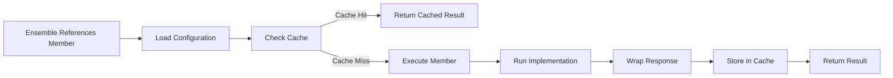

## What are Members?

In Conductor's musical metaphor, **members are the musicians** in your orchestra. Each member plays one instrument (role) and does it well. Members are the fundamental building blocks that execute specific tasks within an ensemble.

<CardGroup cols={2}>
  <Card title="Think Members" icon="brain">
    AI reasoning with LLMs (GPT-4, Claude, Workers AI)
  </Card>

  <Card title="Function Members" icon="code">
    JavaScript/TypeScript business logic
  </Card>

  <Card title="Data Members" icon="database">
    Storage operations (KV, D1, R2, Vectorize)
  </Card>

  <Card title="API Members" icon="globe">
    HTTP requests to external services
  </Card>
</CardGroup>

## Member Structure

Every member has two parts:

### 1. Configuration (`member.yaml`)

Defines the member's metadata, type, and configuration:

```yaml
name: analyze-company
type: Think
description: Analyze company data and generate insights

config:
  provider: anthropic
  model: claude-3-5-sonnet-20241022
  temperature: 0.7
  maxTokens: 2000
  systemPrompt: "You are an expert business analyst..."

schema:
  input:
    type: object
    properties:
      companyData:
        type: object
      financials:
        type: object
    required: [companyData]

  output:
    type: object
    properties:
      analysis:
        type: string
      confidence:
        type: number
```

### 2. Implementation (`index.ts`)

The actual code that runs when the member executes:

```typescript
// members/analyze-company/index.ts
export default async function analyzeCompany({ input, env }) {
  const { companyData, financials } = input;

  // Your implementation
  const analysis = await generateAnalysis(companyData, financials);

  return {
    analysis: analysis.text,
    confidence: analysis.score
  };
}
```

## Member Types Explained

### Think Members

AI reasoning members that call LLM providers:

```yaml
name: summarize-text
type: Think
config:
  provider: openai
  model: gpt-4o
  routing: cloudflare-gateway  # Use AI Gateway for caching
```

**When to use:**
- Natural language understanding
- Content generation
- Classification and extraction
- Reasoning and analysis

**Providers supported:**
- OpenAI (GPT-4, GPT-4o, o1)
- Anthropic (Claude 3.5, Claude 3)
- Workers AI (Edge models)
- Groq (Ultra-fast inference)
- Custom providers

### Function Members

JavaScript/TypeScript code execution:

```typescript
// members/calculate-metrics/index.ts
export default async function calculateMetrics({ input }) {
  const { revenue, costs } = input;

  return {
    profit: revenue - costs,
    margin: ((revenue - costs) / revenue) * 100,
    timestamp: Date.now()
  };
}
```

**When to use:**
- Data transformation
- Business logic
- Calculations
- Formatting and validation

### Data Members

Storage operations with Cloudflare primitives:

```yaml
name: save-analysis
type: Data
config:
  storage: d1
  operation: put
  binding: DB  # wrangler.toml binding name
```

**Operations:**
- `get` - Retrieve data
- `put` - Store data
- `delete` - Remove data
- `list` - Query multiple items

**Storage types:**
- **KV** - Key-value cache (global, eventually consistent)
- **D1** - SQLite database (serverless SQL)
- **R2** - Object storage (S3-compatible)
- **Vectorize** - Vector database (embeddings)

### API Members

HTTP requests to external services:

```yaml
name: fetch-pricing
type: API
config:
  url: "https://api.example.com/pricing"
  method: POST
  headers:
    Authorization: "Bearer ${env.API_KEY}"
  timeout: 30000
  retries: 3
```

**Features:**
- Automatic retry with exponential backoff
- Timeout handling
- Header interpolation
- JSON/text response parsing

## Member Lifecycle



### Execution Flow

1. **Load**: Member configuration is loaded
2. **Cache Check**: Check if cached response exists
3. **Execute**: Run the member's implementation
4. **Wrap**: Format response with metadata
5. **Cache**: Store result (if caching enabled)
6. **Return**: Provide result to ensemble

### Response Format

Every member returns a standardized response:

```typescript
interface MemberResponse {
  success: boolean
  data?: unknown           // Member's output
  error?: string          // Error message if failed
  timestamp: string       // ISO 8601 timestamp
  cached: boolean         // Was this from cache?
  executionTime: number   // Milliseconds
  metadata?: Record<string, unknown>
}
```

## Built-In Members

Conductor provides 6 production-ready built-in members:

<AccordionGroup>
  <Accordion title="scrape - Web Scraping" icon="globe">
    3-tier fallback strategy: Cloudflare Browser Rendering → Puppeteer → HTML parsing

    ```yaml
    - member: scrape
      input:
        url: ${input.website}
        output: markdown
    ```
  </Accordion>

  <Accordion title="validate - Quality Evaluation" icon="check-circle">
    4 evaluator types: rule-based, LLM judge, NLP, embedding similarity

    ```yaml
    - member: validate
      input:
        content: ${generate-content.output.text}
        criteria:
          accuracy: "Content must be factually accurate"
          completeness: "All required sections present"
    ```
  </Accordion>

  <Accordion title="rag - RAG System" icon="database">
    Vectorize integration with semantic search

    ```yaml
    - member: rag
      input:
        operation: search
        query: ${input.question}
        topK: 5
    ```
  </Accordion>

  <Accordion title="hitl - Human-in-the-Loop" icon="user">
    Approval workflows with notifications

    ```yaml
    - member: hitl
      input:
        operation: suspend
        ttl: 3600
        notificationUrl: "https://example.com/approve"
    ```
  </Accordion>

  <Accordion title="fetch - HTTP Client" icon="arrow-right">
    Retry logic and timeout handling

    ```yaml
    - member: fetch
      input:
        url: "https://api.example.com/data"
        method: GET
        retries: 3
    ```
  </Accordion>

  <Accordion title="queries - SQL Execution" icon="table">
    Hyperdrive integration for databases

    ```yaml
    - member: queries
      input:
        operation: execute
        query: "SELECT * FROM customers WHERE id = ?"
        params: [${input.customerId}]
    ```
  </Accordion>
</AccordionGroup>

## Member Best Practices

### 1. Single Responsibility

Each member should do one thing well:

<CodeGroup>
```yaml Good - Single Responsibility
# ✅ Each member has one clear purpose
- member: fetch-company-data
- member: analyze-financials
- member: generate-report
```

```yaml Bad - Multiple Responsibilities
# ❌ One member doing too much
- member: fetch-analyze-and-report
```
</CodeGroup>

### 2. Explicit Dependencies

Declare what state you need:

```yaml
flow:
  - member: analyze-company
    state:
      use: [companyData, financials]  # Explicit dependencies
      set: [analysis]                 # Clear outputs
```

### 3. Enable Caching

Cache expensive operations:

```yaml
- member: expensive-ai-call
  cache:
    ttl: 3600  # 1 hour
```

### 4. Use Schema Validation

Define input/output schemas:

```yaml
schema:
  input:
    type: object
    properties:
      domain:
        type: string
        pattern: "^[a-z0-9-]+\\.[a-z]{2,}$"
    required: [domain]
```

### 5. Handle Errors Gracefully

Return structured errors:

```typescript
export default async function myMember({ input }) {
  try {
    const result = await doSomething(input);
    return { result };
  } catch (error) {
    // Conductor will wrap this in error response
    throw new Error(`Failed to process: ${error.message}`);
  }
}
```

## Member Discovery

Members are discovered in this order:

1. **Built-in members** (`scrape`, `validate`, `rag`, `hitl`, `fetch`, `queries`)
2. **User-defined members** (in your project's `members/` directory)
3. **Versioned members** (name@version via Edgit - planned)

```yaml
flow:
  - member: scrape                    # Built-in
  - member: my-custom-member          # User-defined
  - member: my-prompt@v1.2.0         # Versioned (future)
```

## Creating Custom Members

Use the SDK factory functions for simplified member creation:

```typescript
import { createFunctionMember } from '@ensemble-edge/conductor/sdk';

export default createFunctionMember({
  async handler({ input, state, setState, env }) {
    // Your logic here
    const result = await processData(input.data);

    // Optionally update shared state
    if (setState) {
      setState({ processedData: result });
    }

    return { result };
  }
});
```

## Related Documentation

<CardGroup cols={2}>
  <Card
    title="Member Types"
    icon="users"
    href="/conductor/member-types/overview"
  >
    Detailed guide for each member type
  </Card>

  <Card
    title="Built-In Members"
    icon="cube"
    href="/conductor/built-in-members/overview"
  >
    Documentation for production-ready members
  </Card>

  <Card
    title="Creating Members Guide"
    icon="plus"
    href="/conductor/guides/creating-members"
  >
    Step-by-step guide to building custom members
  </Card>

  <Card
    title="Member API Reference"
    icon="code"
    href="/conductor-api/members/base-member"
  >
    Complete API documentation for members
  </Card>
</CardGroup>
