## Overview

Conductor provides six member types, each optimized for specific tasks. Think of them as different instruments in your orchestra - each plays a unique role.

<CardGroup cols={2}>
  <Card title="Think" icon="brain" href="/conductor/member-types/think">
    AI reasoning with LLMs (GPT-4, Claude, Workers AI)
  </Card>

  <Card title="Function" icon="code" href="/conductor/member-types/function">
    JavaScript/TypeScript business logic
  </Card>

  <Card title="Data" icon="database" href="/conductor/member-types/data">
    Storage operations (KV, D1, R2, Vectorize)
  </Card>

  <Card title="API" icon="globe" href="/conductor/member-types/api">
    HTTP requests to external services
  </Card>

  <Card title="Email" icon="envelope" href="/conductor/member-types/email">
    Email sending with templates and multi-provider support
  </Card>

  <Card title="SMS" icon="message" href="/conductor/member-types/sms">
    SMS messaging with Twilio, Vonage, and AWS SNS
  </Card>
</CardGroup>

## Type Comparison

| Feature | Think | Function | Data | API |
|---------|-------|----------|------|-----|
| **Purpose** | AI reasoning | Business logic | Storage ops | HTTP requests |
| **Language** | Prompts | TypeScript | Queries | Config |
| **Cost** | $$ (per token) | Free | $ (per operation) | Varies |
| **Latency** | 1-3s | < 10ms | < 100ms | 500ms-3s |
| **Caching** | Highly beneficial | Optional | Beneficial | Beneficial |
| **Deterministic** | No | Yes | Yes | Depends |

## When to Use Each Type

### Think Members

**Use for:**
- Natural language understanding
- Content generation and summarization
- Classification and extraction
- Sentiment analysis
- Complex reasoning tasks
- Creative writing

**Don't use for:**
- Simple calculations (use Function)
- Data retrieval (use Data)
- Deterministic lookups (use Function)

**Example tasks:**
```yaml
- Analyze company from website data
- Generate marketing copy
- Extract structured data from text
- Classify support tickets
- Answer questions from documentation
```

### Function Members

**Use for:**
- Data transformation and formatting
- Business logic and calculations
- Validation and sanitization
- String manipulation
- Math operations
- Conditional logic

**Don't use for:**
- AI reasoning (use Think)
- Database queries (use Data)
- HTTP requests (use API)

**Example tasks:**
```yaml
- Calculate metrics (profit, margin, ROI)
- Format data for display
- Validate email addresses
- Parse and transform JSON
- Generate cache keys
- Apply business rules
```

### Data Members

**Use for:**
- Database queries (D1, Hyperdrive)
- Key-value storage (KV)
- Object storage (R2)
- Vector search (Vectorize)
- Caching operations
- Session management

**Don't use for:**
- AI reasoning (use Think)
- Business logic (use Function)
- External APIs (use API)

**Example tasks:**
```yaml
- Query users from database
- Store session data in KV
- Upload files to R2
- Search documents with Vectorize
- Cache expensive computations
- Retrieve configuration
```

### API Members

**Use for:**
- External API calls (REST, GraphQL)
- Webhooks and integrations
- Third-party services
- Payment processing
- Email sending
- SMS notifications

**Don't use for:**
- AI calls (use Think with routing)
- Internal storage (use Data)
- Simple logic (use Function)

**Example tasks:**
```yaml
- Fetch pricing from external API
- Send email via SendGrid
- Process payment with Stripe
- Post to Slack webhook
- Fetch weather data
- Validate address with API
```

## Type Selection Flowchart

```mermaid
graph TD
    A[Need to accomplish a task] --> B{Requires AI reasoning?}
    B -->|Yes| C[Think Member]
    B -->|No| D{Involves storage?}
    D -->|Yes| E[Data Member]
    D -->|No| F{External HTTP call?}
    F -->|Yes| G[API Member]
    F -->|No| H[Function Member]

    style C fill:#E91E8C
    style E fill:#4FD1C5
    style G fill:#2D1B69
    style H fill:#1A0F4A
```



## Composition Patterns

### Think + Function

AI generates content, Function formats it:

```yaml
flow:
  - member: generate-summary
    type: Think

  - member: format-for-display
    type: Function
    input:
      summary: ${generate-summary.output.text}
```

### Data + Think

Fetch data, analyze with AI:

```yaml
flow:
  - member: fetch-company-data
    type: Data

  - member: analyze-company
    type: Think
    input:
      companyData: ${fetch-company-data.output.data}
```

### API + Function

Fetch from API, transform with logic:

```yaml
flow:
  - member: fetch-pricing
    type: API

  - member: calculate-discount
    type: Function
    input:
      price: ${fetch-pricing.output.price}
```

### All Four Together

Complete workflow using all types:

```yaml
flow:
  # 1. Fetch from external API
  - member: fetch-company-profile
    type: API

  # 2. Store in cache
  - member: cache-profile
    type: Data
    input:
      profile: ${fetch-company-profile.output}

  # 3. Analyze with AI
  - member: analyze-company
    type: Think
    input:
      profile: ${fetch-company-profile.output}

  # 4. Format results
  - member: format-report
    type: Function
    input:
      analysis: ${analyze-company.output}
```

## Cost Optimization by Type

### Think Members (Most Expensive)

```yaml
# Cache aggressively
- member: generate-summary
  type: Think
  cache:
    ttl: 86400  # 24 hours

# Use cheaper models for simple tasks
config:
  model: gpt-4o-mini  # vs gpt-4o
```

### Function Members (Free)

```yaml
# No external costs - optimize for performance
- member: calculate-metrics
  type: Function
  # No cache needed - instant execution
```

### Data Members (Low Cost)

```yaml
# Cache frequent queries
- member: get-user
  type: Data
  cache:
    ttl: 3600  # 1 hour
```

### API Members (Variable Cost)

```yaml
# Cache responses
- member: fetch-pricing
  type: API
  cache:
    ttl: 3600
  config:
    retries: 3  # Retry on failure
```

## Performance Characteristics

### Latency Comparison

```typescript
// Actual measured latencies (approximate)

// Think member (AI call)
const thinkResult = await executor.executeMember('analyze', input);
// Cold: ~2000ms, Warm: ~1500ms, Cached: ~5ms

// Function member
const funcResult = await executor.executeMember('calculate', input);
// Cold: ~5ms, Warm: ~2ms, Cached: ~5ms

// Data member (KV)
const dataResult = await executor.executeMember('get-cache', input);
// Cold: ~50ms, Warm: ~20ms, Cached: ~5ms

// API member (external)
const apiResult = await executor.executeMember('fetch-pricing', input);
// Cold: ~1000ms, Warm: ~800ms, Cached: ~5ms
```

### Throughput Comparison

| Type | Requests/sec | Bottleneck |
|------|--------------|------------|
| Function | 10,000+ | CPU |
| Data (KV) | 1,000+ | Network |
| API | 100+ | External service |
| Think | 10+ | AI provider rate limits |

## Error Handling by Type

### Think Members

```yaml
# AI calls may fail - use retries
- member: generate-content
  type: Think
  retry:
    maxAttempts: 3
    backoff: exponential
```

### Function Members

```typescript
// Handle errors in code
export default async function ({ input }) {
  try {
    return { result: riskyOperation(input) };
  } catch (error) {
    return { error: error.message, fallback: defaultValue };
  }
}
```

### Data Members

```yaml
# Database errors should propagate
- member: get-user
  type: Data
  # Let errors fail fast - indicates system issue
```

### API Members

```yaml
# External APIs may be unreliable
- member: fetch-data
  type: API
  config:
    retries: 3
    timeout: 30000
  # Fallback to cached data
```

## Type-Specific Features

### Think Members

- AI provider selection (OpenAI, Anthropic, Workers AI, Groq)
- Routing modes (cloudflare, cloudflare-gateway, direct)
- Structured output with JSON schemas
- System prompts and temperature control

### Function Members

- Full TypeScript/JavaScript support
- Access to shared utilities (`src/lib/`)
- State management (read/write)
- No configuration needed

### Data Members

- Storage abstraction (KV, D1, R2, Vectorize)
- CRUD operations (get, put, delete, list, query)
- Binding configuration
- Query parameterization

### API Members

- HTTP method support (GET, POST, PUT, DELETE, PATCH)
- Header interpolation
- Retry logic with exponential backoff
- Timeout configuration

## Best Practices by Type

### Think Members

```yaml
# 1. Use AI Gateway for caching
config:
  routing: cloudflare-gateway

# 2. Lower temperature for consistency
config:
  temperature: 0.3

# 3. Enable caching
cache:
  ttl: 3600

# 4. Use structured output
config:
  responseFormat:
    type: json_schema
```

### Function Members

```typescript
// 1. Keep functions pure
export default async function ({ input }) {
  return { result: calculate(input) };  // No side effects
}

// 2. Use TypeScript types
interface Input { revenue: number; costs: number; }
interface Output { profit: number; margin: number; }

// 3. Validate input
if (input.revenue <= 0) {
  throw new Error('Revenue must be positive');
}

// 4. Return structured data
return { profit, margin, timestamp: Date.now() };
```

### Data Members

```yaml
# 1. Use proper binding names
config:
  binding: DB  # Matches wrangler.toml

# 2. Parameterize queries
config:
  query: "SELECT * FROM users WHERE id = ?"

# 3. Cache frequent queries
cache:
  ttl: 3600

# 4. Use appropriate storage
# KV: session data, cache
# D1: relational data
# R2: files, objects
# Vectorize: vector search
```

### API Members

```yaml
# 1. Configure retries
config:
  retries: 3
  timeout: 30000

# 2. Use environment variables for secrets
config:
  headers:
    Authorization: "Bearer ${env.API_KEY}"

# 3. Cache responses
cache:
  ttl: 3600

# 4. Handle errors gracefully
# Set appropriate timeouts
```

## Related Documentation

<CardGroup cols={2}>
  <Card
    title="Think Members"
    icon="brain"
    href="/conductor/member-types/think"
  >
    AI reasoning with LLMs
  </Card>

  <Card
    title="Function Members"
    icon="code"
    href="/conductor/member-types/function"
  >
    JavaScript business logic
  </Card>

  <Card
    title="Data Members"
    icon="database"
    href="/conductor/member-types/data"
  >
    Storage operations
  </Card>

  <Card
    title="API Members"
    icon="globe"
    href="/conductor/member-types/api"
  >
    HTTP requests
  </Card>

  <Card
    title="Email Members"
    icon="envelope"
    href="/conductor/member-types/email"
  >
    Email sending
  </Card>

  <Card
    title="SMS Members"
    icon="message"
    href="/conductor/member-types/sms"
  >
    SMS messaging
  </Card>

  <Card
    title="Creating Members"
    icon="plus"
    href="/conductor/guides/creating-members"
  >
    Build custom members
  </Card>

  <Card
    title="Built-In Members"
    icon="cube"
    href="/conductor/built-in-members/overview"
  >
    Production-ready members
  </Card>
</CardGroup>
