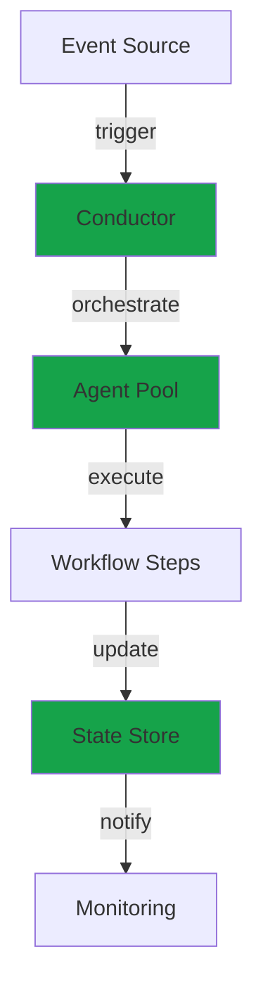

<Warning>
  **Coming Soon** - Conductor is currently in development. This documentation is a preview of planned features.
</Warning>

## What is Conductor?

Conductor is an orchestration platform for managing AI agents, workflows, and complex multi-step processes. It builds on Edgit's component registry to provide advanced coordination and execution capabilities.

## Planned Features

<CardGroup cols={2}>
  <Card
    title="Agent Orchestration"
    icon="network-wired"
  >
    Coordinate multiple AI agents with message passing and state management
  </Card>

  <Card
    title="Workflow Engine"
    icon="diagram-project"
  >
    Define complex workflows with branching, loops, and error handling
  </Card>

  <Card
    title="Event-Driven Architecture"
    icon="bolt"
  >
    Trigger workflows based on events, schedules, or external webhooks
  </Card>

  <Card
    title="Monitoring & Observability"
    icon="chart-line"
  >
    Real-time monitoring of agent performance and workflow execution
  </Card>
</CardGroup>

## Architecture Preview

## Use Cases

<AccordionGroup>
  <Accordion icon="robot" title="Multi-Agent Systems">
    Coordinate teams of specialized AI agents working together on complex tasks.

    **Example**: Customer service system with routing, support, and escalation agents
  </Accordion>

  <Accordion icon="workflow" title="Business Process Automation">
    Automate complex business workflows with human-in-the-loop approvals.

    **Example**: Invoice processing with validation, approval, and payment steps
  </Accordion>

  <Accordion icon="calendar" title="Scheduled Workflows">
    Run workflows on schedules or in response to events.

    **Example**: Daily data pipeline with extraction, transformation, and loading
  </Accordion>

  <Accordion icon="scale-balanced" title="Load Balancing">
    Distribute work across multiple agent instances for scalability.

    **Example**: Parallel processing of user requests across agent pool
  </Accordion>
</AccordionGroup>

## Integration with Edgit

Conductor leverages Edgit's component registry:

- **Agent Discovery**: Automatically discover agents registered in Edgit
- **Version Management**: Use Git tags for workflow versioning
- **Deployment**: Deploy workflows alongside agents
- **Observability**: Track which workflow versions use which agent versions

## Roadmap

<Steps>
  <Step title="Q1 2026: Core Engine">
    - Basic workflow engine
    - Agent lifecycle management
    - State persistence
  </Step>

  <Step title="Q2 2026: Orchestration">
    - Multi-agent coordination
    - Event-driven triggers
    - Monitoring dashboard
  </Step>

  <Step title="Q3 2026: Advanced Features">
    - Distributed execution
    - Complex workflow patterns
    - Enterprise integrations
  </Step>

  <Step title="Q4 2026: Production Ready">
    - Performance optimizations
    - Security hardening
    - Full documentation
  </Step>
</Steps>

## Stay Updated

<CardGroup cols={2}>
  <Card
    title="GitHub Discussions"
    icon="github"
    href="https://github.com/ensemble-edge/conductor/discussions"
  >
    Join the conversation about Conductor features
  </Card>

  <Card
    title="Early Access"
    icon="envelope"
    href="mailto:conductor@ensemble.ai"
  >
    Request early access to Conductor beta
  </Card>
</CardGroup>

## Related Documentation

<CardGroup cols={2}>
  <Card
    title="Edgit Documentation"
    icon="cube"
    href="/edgit/overview"
  >
    Learn about the component registry foundation
  </Card>

  <Card
    title="Cloud"
    icon="cloud"
    href="/cloud/overview"
  >
    Managed service for component editing
  </Card>
</CardGroup>
