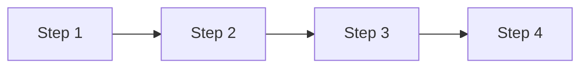
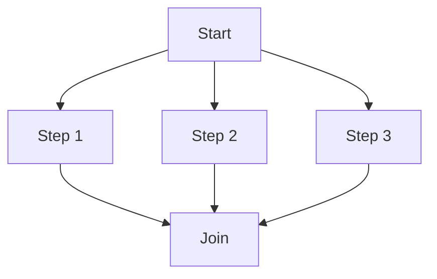
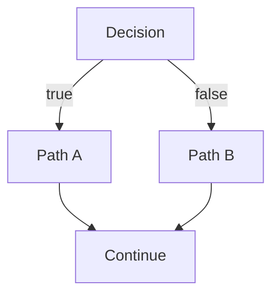
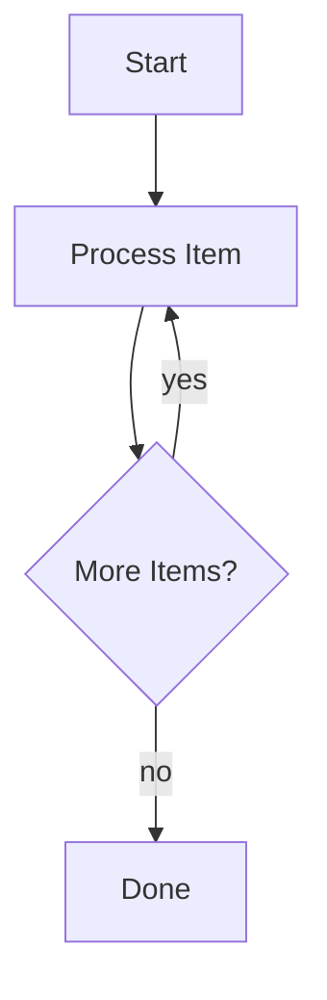

<Warning>
  **Coming Soon** - Workflow features are planned for Conductor v1.0.
</Warning>

## What are Workflows?

Workflows define sequences of steps that coordinate agents, handle data, and implement business logic.

## Workflow Definition (Planned)

```yaml
name: customer-onboarding
version: 1.0.0
description: Automated customer onboarding workflow

triggers:
  - event: customer.signup
  - schedule: "0 9 * * 1"  # Every Monday at 9am

steps:
  - id: validate
    agent: validator
    input:
      data: ${{ event.customer }}
    onError: notify-admin

  - id: create-account
    agent: account-creator
    input:
      customer: ${{ steps.validate.output }}
    requires: [validate]

  - id: send-welcome
    agent: email-sender
    input:
      to: ${{ event.customer.email }}
      template: welcome
    requires: [create-account]

  - id: notify-sales
    agent: slack-notifier
    input:
      channel: sales
      message: "New customer: ${{ event.customer.name }}"
    requires: [create-account]
```

## Workflow Features

<AccordionGroup>
  <Accordion icon="code-branch" title="Branching & Conditionals">
    Execute different paths based on conditions

    ```yaml
    - id: check-tier
      type: decision
      condition: ${{ customer.spend > 1000 }}
      onTrue: assign-premium-support
      onFalse: assign-standard-support
    ```
  </Accordion>

  <Accordion icon="rotate" title="Loops & Iteration">
    Process collections and repeat steps

    ```yaml
    - id: process-orders
      type: forEach
      items: ${{ customer.orders }}
      step:
        agent: order-processor
        input: ${{ item }}
    ```
  </Accordion>

  <Accordion icon="clock" title="Timeouts & Delays">
    Control execution timing

    ```yaml
    - id: wait-for-approval
      type: wait
      timeout: 24h
      onTimeout: escalate
    ```
  </Accordion>

  <Accordion icon="triangle-exclamation" title="Error Handling">
    Gracefully handle failures

    ```yaml
    - id: api-call
      agent: external-api
      retry:
        maxAttempts: 3
        backoff: exponential
      onError: log-and-continue
    ```
  </Accordion>
</AccordionGroup>

## Workflow Patterns

### Sequential


### Parallel


### Conditional


### Loop


## State Management

Workflows maintain state throughout execution:

- **Input**: Initial workflow parameters
- **Context**: Shared data across steps
- **Step Outputs**: Results from each step
- **Variables**: Workflow-scoped storage

## Versioning

Workflows are versioned like components:

```bash
# Register workflow in Edgit
edgit add workflow customer-onboarding workflows/onboarding.yaml

# Tag version
edgit tag customer-onboarding v1.0.0

# Deploy to environment
edgit deploy customer-onboarding v1.0.0 --to production
```

## Coming Soon

- Workflow DSL reference
- Built-in step types
- Integration patterns
- Testing workflows
- Monitoring and debugging

<Info>
  Want to discuss workflow patterns? Join [GitHub Discussions](https://github.com/ensemble-edge/conductor/discussions).
</Info>
