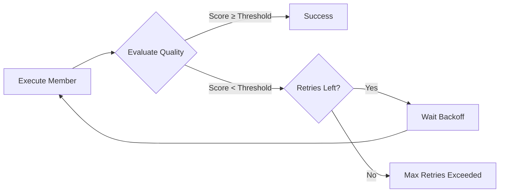

## What is Quality Scoring?

Quality scoring validates that member outputs meet your standards. If the quality is too low, Conductor can automatically retry the member with exponential backoff until it passes or reaches the retry limit.

<Card title="Use Case" icon="lightbulb">
  You're generating marketing copy with AI. Sometimes it's off-brand, too long, or missing key points. With scoring, Conductor automatically retries until the content meets your quality bar - no manual intervention needed.
</Card>

## How It Works



## Basic Setup

### Ensemble-Level Configuration

Set defaults for all members:

```yaml
name: content-generation

scoring:
  enabled: true
  defaultThresholds:
    minimum: 0.7      # Must score at least 0.7
    target: 0.8       # Aim for 0.8+
    excellent: 0.9    # Great if 0.9+
  maxRetries: 3
  backoffStrategy: exponential  # or 'linear', 'fixed'

flow:
  - member: generate-content  # Uses default thresholds
```

### Member-Level Configuration

Override defaults for specific members:

```yaml
flow:
  - member: generate-headline
    scoring:
      evaluator: validate
      thresholds:
        minimum: 0.8  # Stricter for headlines
      criteria:
        length: "Must be under 60 characters"
        clarity: "Must be clear and engaging"
        brand: "Must match brand voice"
      onFailure: retry
      retryLimit: 5
      requireImprovement: true  # Each retry must score higher
```

## Scoring Evaluators

### 1. Rule-Based Evaluator

Fast, deterministic validation:

```yaml
- member: generate-content
  scoring:
    evaluator: validate
    evaluatorConfig:
      type: rule
    criteria:
      length:
        rule: "output.text.length <= 500"
        weight: 0.3
      hasTitle:
        rule: "output.title != null"
        weight: 0.2
      hasCallToAction:
        rule: "output.cta != null"
        weight: 0.5
```

**When to use:**
- Fast validation
- Clear rules (length, format, required fields)
- No ambiguity
- Cost-effective

### 2. LLM Judge Evaluator

AI-powered quality assessment:

```yaml
- member: generate-article
  scoring:
    evaluator: validate
    evaluatorConfig:
      type: judge
      model: gpt-4o
      systemPrompt: "You are a content quality expert..."
    criteria:
      accuracy: "Content must be factually accurate"
      completeness: "All required sections present"
      clarity: "Writing is clear and professional"
      engagement: "Content is engaging and valuable"
    thresholds:
      minimum: 0.8
```

**When to use:**
- Subjective quality (tone, style, engagement)
- Complex criteria
- Human-like judgment needed
- Higher accuracy worth the cost

### 3. NLP Evaluator

Natural language analysis:

```yaml
- member: generate-summary
  scoring:
    evaluator: validate
    evaluatorConfig:
      type: nlp
    criteria:
      sentiment:
        target: "positive"
        weight: 0.3
      readability:
        target: "easy"
        weight: 0.4
      keywords:
        required: ["innovation", "growth", "success"]
        weight: 0.3
```

**When to use:**
- Sentiment analysis
- Readability scoring
- Keyword presence
- Language metrics

### 4. Embedding Similarity

Compare against reference examples:

```yaml
- member: generate-description
  scoring:
    evaluator: validate
    evaluatorConfig:
      type: embedding
      referenceExamples:
        - "High-quality example 1..."
        - "High-quality example 2..."
      similarityThreshold: 0.8
```

**When to use:**
- Style matching
- Semantic similarity
- Example-based validation
- Consistency checks

## Retry Strategies

### Exponential Backoff (Recommended)

Wait longer between each retry:

```yaml
scoring:
  backoffStrategy: exponential
  maxRetries: 5

# Retry delays: 1s, 2s, 4s, 8s, 16s
```

**Best for:**
- AI provider rate limits
- Non-deterministic failures
- Cost optimization

### Linear Backoff

Consistent wait times:

```yaml
scoring:
  backoffStrategy: linear
  maxRetries: 3

# Retry delays: 2s, 4s, 6s
```

**Best for:**
- Predictable load
- Simple retry logic
- Quick recovery

### Fixed Backoff

Same delay every time:

```yaml
scoring:
  backoffStrategy: fixed
  maxRetries: 3

# Retry delays: 5s, 5s, 5s
```

**Best for:**
- Testing
- Consistent timing requirements
- Simple scenarios

## Progressive Improvement

Require each retry to score higher than the previous attempt:

```yaml
- member: generate-content
  scoring:
    requireImprovement: true
    minImprovement: 0.05  # Must improve by at least 5%
    thresholds:
      minimum: 0.8
    maxRetries: 5
```

**Example progression:**
```
Attempt 1: Score 0.65 ❌ (below 0.8, retry)
Attempt 2: Score 0.72 ✅ (improved, but still below 0.8, retry)
Attempt 3: Score 0.70 ❌ (decreased, reject)
Attempt 4: Score 0.75 ✅ (improved, but still below 0.8, retry)
Attempt 5: Score 0.82 ✅ (improved and passed threshold!)
```

## Failure Handling

### Retry

Automatically retry until passing or max retries:

```yaml
scoring:
  onFailure: retry
  retryLimit: 3
```

### Continue

Log the failure but continue execution:

```yaml
scoring:
  onFailure: continue
```

Use for non-critical quality checks.

### Abort

Stop execution immediately:

```yaml
scoring:
  onFailure: abort
```

Use for critical quality requirements.

## Complete Example

Real-world content generation with comprehensive scoring:

```yaml
name: generate-blog-post
description: Generate high-quality blog post with AI

scoring:
  enabled: true
  defaultThresholds:
    minimum: 0.75
    target: 0.85
    excellent: 0.95
  maxRetries: 5
  backoffStrategy: exponential

flow:
  # Generate outline
  - member: generate-outline
    input:
      topic: ${input.topic}
      keywords: ${input.keywords}
    scoring:
      evaluator: validate
      evaluatorConfig:
        type: rule
      criteria:
        hasIntro:
          rule: "output.sections.includes('Introduction')"
          weight: 0.2
        hasConclusion:
          rule: "output.sections.includes('Conclusion')"
          weight: 0.2
        sectionCount:
          rule: "output.sections.length >= 5"
          weight: 0.3
        keywordCoverage:
          rule: "output.keywords.length >= 3"
          weight: 0.3
      thresholds:
        minimum: 0.8
      onFailure: retry
      retryLimit: 3

  # Generate full content
  - member: generate-content
    input:
      outline: ${generate-outline.output}
      tone: ${input.tone}
    scoring:
      evaluator: validate
      evaluatorConfig:
        type: judge
        model: claude-3-5-sonnet-20241022
        systemPrompt: |
          You are an expert content quality evaluator.
          Evaluate blog posts on multiple dimensions.
      criteria:
        accuracy: "Content is factually accurate and well-researched"
        completeness: "All outline sections are fully developed"
        engagement: "Writing is engaging and maintains reader interest"
        structure: "Clear structure with good flow between sections"
        brandVoice: "Matches professional, informative brand voice"
        grammar: "Excellent grammar and spelling"
        keywords: "Natural integration of target keywords"
      thresholds:
        minimum: 0.85
      onFailure: retry
      retryLimit: 5
      requireImprovement: true
      minImprovement: 0.03

  # Optimize for SEO
  - member: optimize-seo
    input:
      content: ${generate-content.output}
      keywords: ${input.keywords}
    scoring:
      evaluator: validate
      evaluatorConfig:
        type: nlp
      criteria:
        keywordDensity:
          target: 0.02  # 2%
          tolerance: 0.005
          weight: 0.4
        readability:
          target: "easy"
          weight: 0.3
        metaDescription:
          required: true
          maxLength: 160
          weight: 0.3
      thresholds:
        minimum: 0.8
      onFailure: retry
      retryLimit: 3

  # Final quality check
  - member: final-review
    input:
      content: ${optimize-seo.output}
    scoring:
      evaluator: validate
      evaluatorConfig:
        type: embedding
        referenceExamples:
          - "Example of excellent blog post 1..."
          - "Example of excellent blog post 2..."
        similarityThreshold: 0.75
      thresholds:
        minimum: 0.9  # High bar for final output
      onFailure: abort  # Don't publish if quality is low

output:
  content: ${final-review.output.content}
  quality:
    outlineScore: ${generate-outline.scoring.score}
    contentScore: ${generate-content.scoring.score}
    seoScore: ${optimize-seo.scoring.score}
    finalScore: ${final-review.scoring.score}
    totalAttempts: ${generate-content.scoring.attempts}
```

## Scoring State

Access scoring information in outputs:

```yaml
output:
  result: ${generate-content.output}
  quality:
    score: ${generate-content.scoring.score}
    passed: ${generate-content.scoring.passed}
    attempts: ${generate-content.scoring.attempts}
    breakdown: ${generate-content.scoring.breakdown}
```

**Scoring state structure:**
```typescript
interface ScoringResult {
  score: number                // 0.0 - 1.0
  passed: boolean              // Did it meet threshold?
  attempts: number             // How many tries?
  feedback: string             // Evaluator feedback
  breakdown: Record<string, number>  // Score per criterion
  metadata: Record<string, unknown>
}
```

## Best Practices

### 1. Start with Lenient Thresholds

```yaml
# ✅ Start lenient, tighten based on data
thresholds:
  minimum: 0.6

# ❌ Don't start too strict
thresholds:
  minimum: 0.95  # Might never pass
```

### 2. Use Multiple Evaluators

```yaml
# ✅ Combine fast rules with AI judgment
- scoring:
    evaluator: validate
    evaluatorConfig:
      type: rule  # Fast pre-check
    thresholds:
      minimum: 0.7

- scoring:
    evaluator: validate
    evaluatorConfig:
      type: judge  # Thorough AI review
    thresholds:
      minimum: 0.85
```

### 3. Weight Criteria Appropriately

```yaml
criteria:
  critical:
    rule: "output.hasRequiredField"
    weight: 0.5  # 50% of score
  nice-to-have:
    rule: "output.hasOptionalField"
    weight: 0.1  # 10% of score
```

### 4. Set Reasonable Retry Limits

```yaml
# ✅ Good - Balances quality and cost
maxRetries: 3-5

# ❌ Too few - Might not reach quality
maxRetries: 1

# ❌ Too many - Expensive, diminishing returns
maxRetries: 20
```

### 5. Monitor Scoring Metrics

```typescript
const result = await executor.executeEnsemble(ensemble, input);

// Track scoring effectiveness
console.log('Average attempts:', result.metrics.scoringMetrics.avgAttempts);
console.log('Success rate:', result.metrics.scoringMetrics.successRate);
console.log('Cost per success:', result.metrics.scoringMetrics.avgCost);
```

## Cost Optimization

### Cache Evaluations

```yaml
- member: generate-content
  cache:
    ttl: 3600  # Cache results
  scoring:
    evaluator: validate
    # Evaluation is also cached
```

### Use Fast Evaluators First

```yaml
flow:
  # Fast rule check
  - scoring:
      evaluatorConfig:
        type: rule
      thresholds:
        minimum: 0.6

  # Only run expensive AI judge if rules pass
  - scoring:
      evaluatorConfig:
        type: judge
      thresholds:
        minimum: 0.85
```

### Adjust Temperature

```yaml
- member: generate-content
  config:
    temperature: 0.3  # Lower = more consistent = fewer retries
```

## Testing Scoring

```typescript
import { TestConductor } from '@ensemble-edge/conductor/testing';

describe('content generation scoring', () => {
  it('should pass quality checks', async () => {
    const conductor = await TestConductor.create();

    const result = await conductor.executeEnsemble('generate-blog-post', {
      topic: 'AI in healthcare'
    });

    expect(result).toBeSuccessful();
    expect(result.output.quality.finalScore).toBeGreaterThan(0.85);
    expect(result.output.quality.totalAttempts).toBeLessThanOrEqual(3);
  });

  it('should retry on low quality', async () => {
    // Mock low-quality output initially
    conductor.mockAI('generate-content', {
      text: 'bad content'
    });

    const result = await conductor.executeEnsemble('generate-blog-post', input);

    // Should have retried
    expect(result.output.quality.totalAttempts).toBeGreaterThan(1);
  });
});
```

## Related Documentation

<CardGroup cols={2}>
  <Card
    title="Validate Built-In Member"
    icon="check-circle"
    href="/conductor/built-in-members/validate"
  >
    Complete documentation for the validate member
  </Card>

  <Card
    title="Scoring Guide"
    icon="book"
    href="/conductor/guides/scoring"
  >
    Practical scoring patterns and examples
  </Card>

  <Card
    title="Quality Metrics API"
    icon="code"
    href="/conductor-api/core/executor"
  >
    API reference for scoring
  </Card>

  <Card
    title="Testing"
    icon="flask"
    href="/conductor/guides/testing"
  >
    Test your scoring configurations
  </Card>
</CardGroup>
