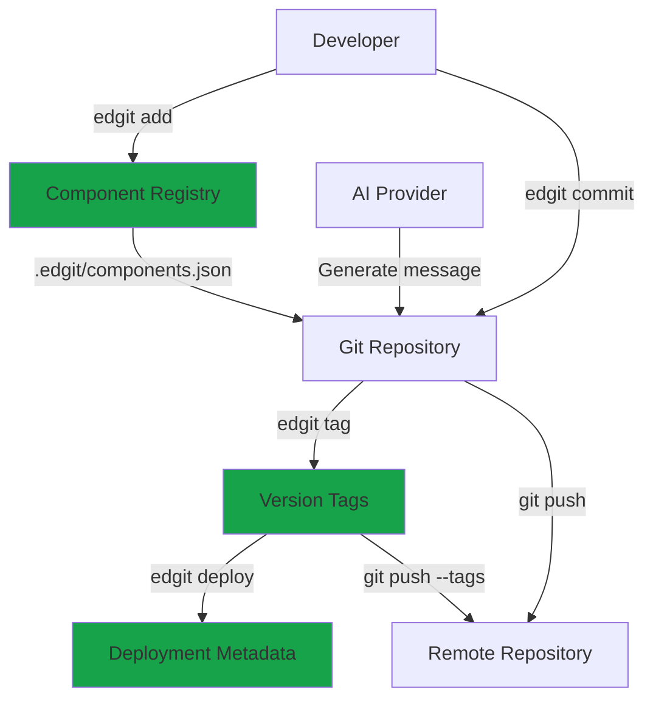

> **Product**: Edgit
> **Version**: v1.0.0
> **Last Updated**: 2025-11-01

## What is Edgit?

Edgit is a CLI tool that extends Git with component-aware functionality. It tracks components (functions, agents, configs) in a registry, uses Git tags for semantic versioning, and provides AI-powered commit message generation.

## Core Concepts

<AccordionGroup>
  <Accordion icon="database" title="Component Registry">
    The `.edgit/components.json` file tracks all components in your repository with their metadata, paths, and configuration.

    ```json
    {
      "version": "1.0",
      "components": {
        "functions": {
          "email-processor": {
            "type": "function",
            "path": "src/functions/email.ts",
            "description": "Processes incoming emails"
          }
        },
        "agents": {
          "support-agent": {
            "type": "agent",
            "path": "src/agents/support.ts",
            "description": "Customer support automation"
          }
        }
      }
    }
    ```
  </Accordion>

  <Accordion icon="tag" title="Git Tag Versioning">
    Edgit uses Git tags in the format `<component>-v<version>` for versioning. This approach is Git-native and doesn't require version files.

    ```bash
    # Create version tag
    edgit tag email-processor v1.0.0
    # Creates git tag: email-processor-v1.0.0

    # List versions
    edgit tag list email-processor
    # Output: v1.0.0, v1.0.1, v1.1.0

    # View tag details
    git show email-processor-v1.0.0
    ```
  </Accordion>

  <Accordion icon="brain" title="AI-Powered Commits">
    When `OPENAI_API_KEY` is configured, Edgit analyzes component changes and generates conventional commit messages automatically.

    ```bash
    # AI generates message based on diffs
    edgit commit
    # Output: "feat(email-processor): add retry logic for failed sends"

    # Manual override still works
    edgit commit -m "your custom message"
    ```
  </Accordion>

  <Accordion icon="rocket" title="Deployment Tracking">
    Edgit tracks which component versions are deployed to which environments using Git tag metadata.

    ```bash
    # Mark as deployed
    edgit deploy email-processor v1.0.0 --to production

    # Check status
    edgit status email-processor
    # Output:
    # staging: v0.9.0 (deployed 2025-10-15)
    # production: v1.0.0 (deployed 2025-11-01)
    ```
  </Accordion>
</AccordionGroup>

## Key Features

### Component Management
- **Registry-based tracking**: All components in one place
- **Multiple types**: Functions, agents, configs, custom types
- **Metadata support**: Description, dependencies, configuration
- **Path-based detection**: Automatically detect component changes in commits

### Versioning
- **Git-native tags**: Use existing Git infrastructure
- **Semantic versioning**: Enforced v{major}.{minor}.{patch} format
- **Component-scoped**: Each component has independent version history
- **No package.json clutter**: Versions are tags, not files

### AI Integration
- **Automatic commit messages**: Conventional commits based on diffs
- **Component-aware**: Understands which components changed
- **Configurable**: Use OpenAI or custom providers
- **Opt-in**: Works with or without AI features

### Deployment Workflows
- **Environment tracking**: Know what's deployed where
- **Version history**: Audit trail of all deployments
- **Git integration**: Leverage existing Git workflows
- **Metadata support**: Add custom deployment information

## Architecture



## Use Cases

<CardGroup cols={2}>
  <Card
    title="Monorepo Component Management"
    icon="folder-tree"
  >
    Track hundreds of functions, agents, and configs in a single repository with independent versioning.
  </Card>

  <Card
    title="Serverless Functions"
    icon="cloud"
  >
    Version and deploy AWS Lambda, Cloudflare Workers, or Vercel Functions independently.
  </Card>

  <Card
    title="AI Agent Libraries"
    icon="robot"
  >
    Manage collections of AI agents with semantic versioning and deployment tracking.
  </Card>

  <Card
    title="Configuration Management"
    icon="gear"
  >
    Track configuration files as components with version history and environment-specific deployments.
  </Card>
</CardGroup>

## Benefits

### For Developers
- **Familiar workflow**: Extends Git, doesn't replace it
- **Less boilerplate**: No version bump commits
- **Better commits**: AI-generated conventional commits
- **Clear history**: Component-scoped version tags

### For Teams
- **Deployment visibility**: Know what's deployed where
- **Independent releases**: Deploy components individually
- **Audit trail**: Git-based deployment history
- **No migration**: Works with existing Git repos

### For Organizations
- **Git-native**: Leverages existing Git infrastructure
- **No vendor lock-in**: Standard Git tags and metadata
- **Scalable**: Works with repos of any size
- **Secure**: Uses your Git authentication

## Comparison

| Feature | Edgit | Lerna | Changesets | Nx |
|---------|-------|-------|------------|-----|
| Git Tag Versioning | ✅ | ❌ | ❌ | ❌ |
| Component Registry | ✅ | ❌ | ❌ | ✅ |
| AI Commit Messages | ✅ | ❌ | ❌ | ❌ |
| Deployment Tracking | ✅ | ❌ | ❌ | ❌ |
| Independent Versioning | ✅ | ✅ | ✅ | ✅ |
| Monorepo Support | ✅ | ✅ | ✅ | ✅ |
| Zero Config | ✅ | ❌ | ❌ | ❌ |

## Getting Started

<Steps>
  <Step title="Install">
    ```bash
    npm install -g @ensemble/edgit
    ```
  </Step>

  <Step title="Initialize">
    ```bash
    cd your-project
    edgit init
    ```
  </Step>

  <Step title="Add Component">
    ```bash
    edgit add function my-function src/functions/my-function.ts
    ```
  </Step>

  <Step title="Create Version">
    ```bash
    git add .
    edgit commit
    edgit tag my-function v1.0.0
    ```
  </Step>
</Steps>

[View detailed quick start →](/getting-started/edgit)

## Next Steps

<CardGroup cols={2}>
  <Card
    title="Installation Guide"
    icon="download"
    href="/edgit/installation"
  >
    Detailed setup instructions
  </Card>

  <Card
    title="Configuration"
    icon="gear"
    href="/edgit/configuration"
  >
    Environment variables and options
  </Card>

  <Card
    title="CLI Reference"
    icon="terminal"
    href="/edgit/api-reference/cli"
  >
    Complete command documentation
  </Card>

  <Card
    title="Examples"
    icon="code"
    href="/edgit/examples/basic-workflow"
  >
    Real-world usage patterns
  </Card>
</CardGroup>
